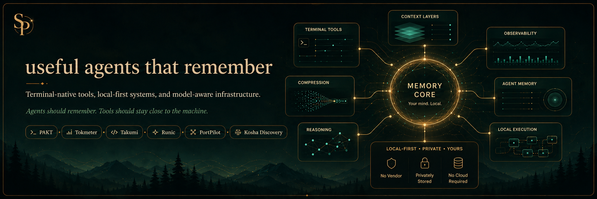

  

Memory-native developer tools for terminal agents, prompt compression, model discovery, observability, and local-first workflows.

The bet is simple: useful agents are more than better chat boxes. They remember what matters, stay close to the machine, and earn every bit of context they ask for.

### Operating Thesis

Developer work is becoming agentic, but the stack around agents is still mostly amnesic. The missing layer is memory, identity, attention, intention, compression, discovery, observability, and the local workflows that make those pieces useful.

| Layer | Systems |
|---|---|
| Memory core | **Chitragupta** *(private core)*, **[Takumi](https://github.com/sriinnu/takumi)** |
| Context economy | **[PAKT](https://github.com/sriinnu/clipforge-PAKT)**, **[Kosha Discovery](https://github.com/sriinnu/kosha-discovery)** |
| Agent observability | **[Tokmeter](https://github.com/sriinnu/tokmeter)**, **[Runic](https://github.com/sriinnu/Runic)** |
| Local control | **[PortPilot](https://github.com/sriinnu/portpilot)**, **[Command Relay](https://github.com/sriinnu/command-relay)**, **[JSON Zen](https://github.com/sriinnu/json-zen)** |
| Private systems | **Tring CLI** *(private)*, **Woosh** *(private)* |

### Git Pulse

  

### Selected Systems

<table>
  <tr>
    <td width="50%">
      <h3><a href="https://github.com/sriinnu/clipforge-PAKT">PAKT</a></h3>
      

        
        
      

      
Lossless-first prompt compression for structured context. JSON, YAML, CSV, and Markdown stay machine-readable while token weight drops.

      
<code>TypeScript</code> <code>MCP</code> <code>prompt-compression</code>

    </td>
    <td width="50%">
      <h3><a href="https://github.com/sriinnu/tokmeter">Tokmeter</a></h3>
      

        
        
      

      
Observability and cost intelligence for AI coding agents: token usage, provider behavior, budgets, pricing, and spend visibility.

      
<code>TypeScript</code> <code>FinOps</code> <code>agent-observability</code>

    </td>
  </tr>
  <tr>
    <td width="50%">
      <h3><a href="https://github.com/sriinnu/takumi">Takumi</a></h3>
      

        
        
      

      
Terminal-native coding agent with a custom renderer, streaming loop, multi-agent orchestration, and memory-backed workflows.

      
<code>TypeScript</code> <code>terminal</code> <code>multi-agent</code>

    </td>
    <td width="50%">
      <h3><a href="https://github.com/sriinnu/kosha-discovery">Kosha Discovery</a></h3>
      

        
        
      

      
Discovery registry for models, credentials, providers, and pricing across local machines and cloud accounts.

      
<code>TypeScript</code> <code>model-discovery</code> <code>API</code>

    </td>
  </tr>
  <tr>
    <td width="50%">
      <h3><a href="https://github.com/sriinnu/Runic">Runic</a></h3>
      

        
        
      

      
macOS menu bar visibility for AI usage, costs, quotas, and context windows across providers.

      
<code>Swift</code> <code>macOS</code> <code>usage-tracking</code>

    </td>
    <td width="50%">
      <h3><a href="https://github.com/sriinnu/portpilot">PortPilot</a></h3>
      

        
        
      

      
macOS menu bar app and CLI for inspecting ports, local daemons, tunnels, and TCP proxies before they surprise you.

      
<code>Swift</code> <code>CLI</code> <code>local-dev</code>

    </td>
  </tr>
</table>

### Supporting Work

- **[Command Relay](https://github.com/sriinnu/command-relay)**   - remote terminal gateway for long-running tmux-backed coding sessions.
- **Tring CLI** <code>private</code> - multi-platform messaging CLI and daemon stack for WhatsApp, Signal, and Telegram.
- **Woosh** <code>private</code> - privacy-first peer-to-peer messaging across Bluetooth, LAN, and the internet.
- **[Web Suddhi](https://github.com/sriinnu/web-suddhi)**   - browser extension for stripping ads, trackers, cookie banners, and paywalls.
- **[JSON Zen](https://github.com/sriinnu/json-zen)**   - cross-platform JSON toolkit for formatting, validating, fixing, converting, and transforming JSON.

### Writing

I write at **[Invisible Dharma](https://invisibledharma.substack.com)**: dharma, inner life, and whatever survives contact with ordinary life.

Some internals borrow Sanskrit names when they make the model clearer. Externally, the work stays practical: ship the tool, make it useful, keep the poetry from getting in the way.

  <a href="https://x.com/_sriinnu_">X</a> &middot;
  <a href="https://invisibledharma.substack.com">Invisible Dharma</a> &middot;
  <a href="https://github.com/sriinnu?tab=repositories">repositories</a>

