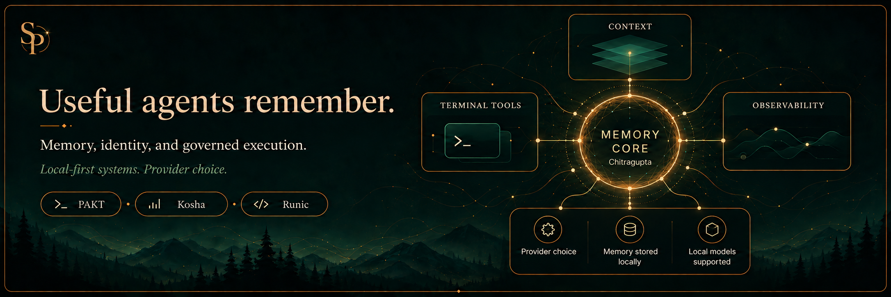

  

I build local-first agent systems with memory, identity, and governed execution — and developer tools that make them useful.

The bet is simple: useful agents remember what matters, stay close to the machine, and earn every bit of context they ask for.

**[Website](https://srinivas.dev/) · [Writing](https://srinivas.dev/writing/) · [Substack](https://whisperstolight.substack.com/) · [X](https://x.com/_sriinnu_)**

### The architecture

Chitragupta is the core engine for continuity, memory, routing, and governance. Vaayu is the assistant experience. AUriva brings them together; Takumi is a specialized coding executor.

Chitragupta, AUriva, and Takumi are still in development. I write about the source architecture and its limits as I build them. Local-first means local memory and state, with local models supported and explicit routes to external providers when a task calls for them.

### Public projects

| Project | What it does |
|---|---|
| **[PAKT](https://github.com/sriinnu/clipforge-PAKT)** | Lossless-first prompt compression for structured data. L1–L3 round-trip byte-for-byte; lossy L4 is opt-in. Savings depend on the input. |
| **[Kosha Discovery](https://github.com/sriinnu/kosha-discovery)** | AI model, credential, and pricing discovery across local and cloud providers. |
| **[Runic](https://github.com/sriinnu/Runic)** | AI usage, quota signals, reset windows, and cost estimates in the macOS menubar. |
| **[Tokmeter](https://github.com/sriinnu/tokmeter)** | Token and cost observability for agent workflows. |
| **[PortPilot](https://github.com/sriinnu/portpilot)** | Local port inspection and process control. |
| **[Web Suddhi](https://github.com/sriinnu/web-suddhi)** | Browser cleanup and hygiene. |

### Notes from the workshop

Names rooted in the Vedic world. Engineering that has to stand on its own.

I write about agent memory, the difference between remembering and obeying, and the work of turning an architecture into something dependable.

- [The Daemon That Sleeps: Nidra and Swapna](https://whisperstolight.substack.com/p/the-daemon-that-sleeps-nidra-and) — sleep cycles, session logs, and the guarded daemon path.
